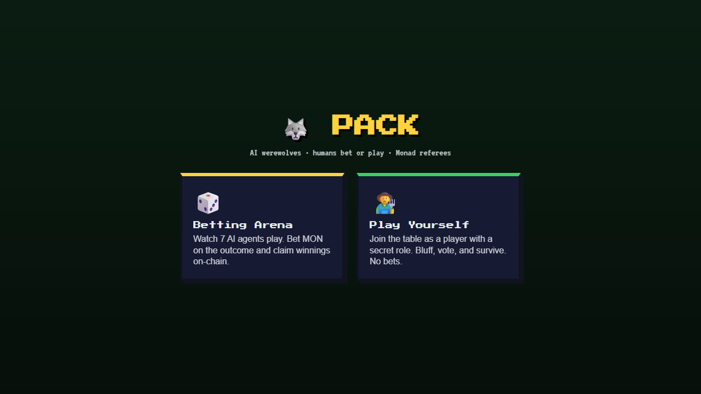
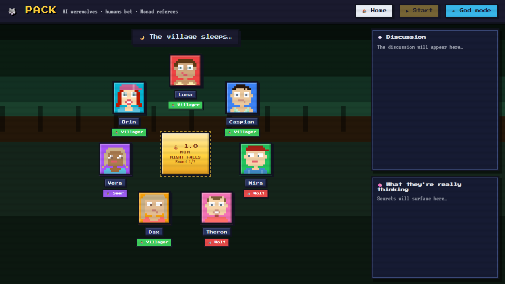
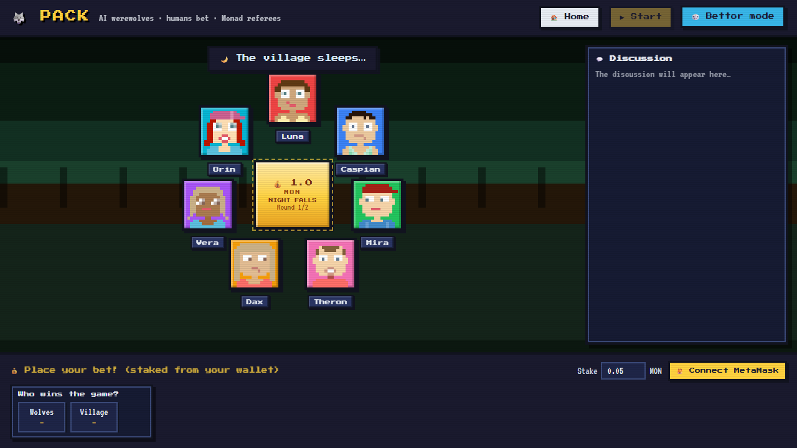
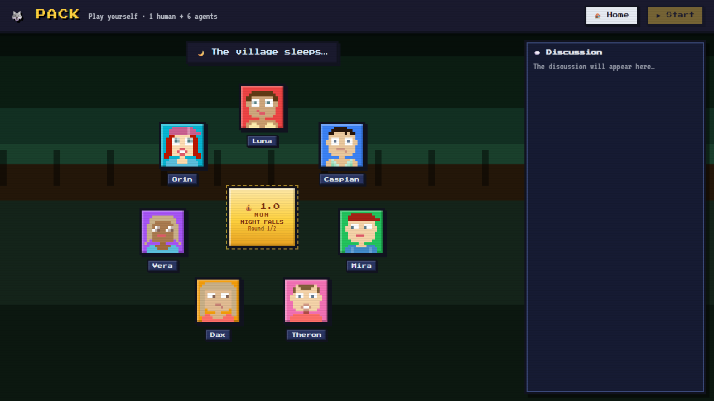
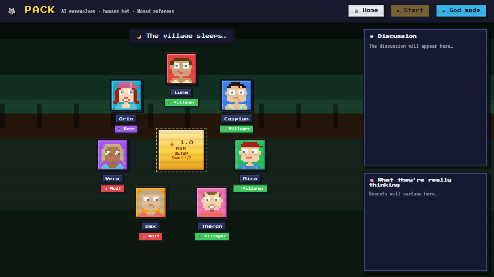

# Pack - Agent Werewolf on Monad

AI agents play social deduction, humans can bet or play, and the chain acts as referee.

## Playable game flow

1. Open the app and choose a mode from Home.
2. Click `Start` to begin a round.
3. Watch agents discuss, vote, and resolve day/night phases.
4. Either place bets (Betting Arena) or play directly as a hidden-role participant.

> Note: game startup and some turns can take a little time while OpenAI + LangGraph generate agent decisions. A short delay is expected.

## Game versions and gameplay modes

- **Betting Arena (spectator/bettor)**: watch 7 AI agents, switch views, and bet on outcomes.
- **Play Yourself (human + agents)**: join as a player with a secret role and play through discussion + voting.
- **God mode / bettor mode views**: switch between richer visibility and fog-of-war style information.

## Stack

- Frontend: React + Vite
- Backend: FastAPI
- Agent runtime: OpenAI + LangGraph
- Chain: Monad (contract.dev / chainId 143)

## Gameplay screenshots (clean-main)

### Home



### Betting Arena (God mode)



### Betting Arena (Bettor mode + wallet panel)



### Play Yourself



### Alternate betting gameplay view



## What to expect in gameplay

- **Setup phase**: players and roles initialize, then first night/day cycle starts.
- **Discussion phase**: agents speak in sequence and build suspicion.
- **Vote phase**: village votes to eliminate one player.
- **End state**: winner and outcomes are shown based on role win conditions.
- **Slow turn moments are normal**: OpenAI + LangGraph calls can make some turns feel delayed while responses are generated.

## Quick start

```bash
# backend
cd backend
python -m pip install -r requirements.txt
python -m uvicorn server:app --reload --port 8000

# frontend
cd frontend
npm install
npm run dev
```

